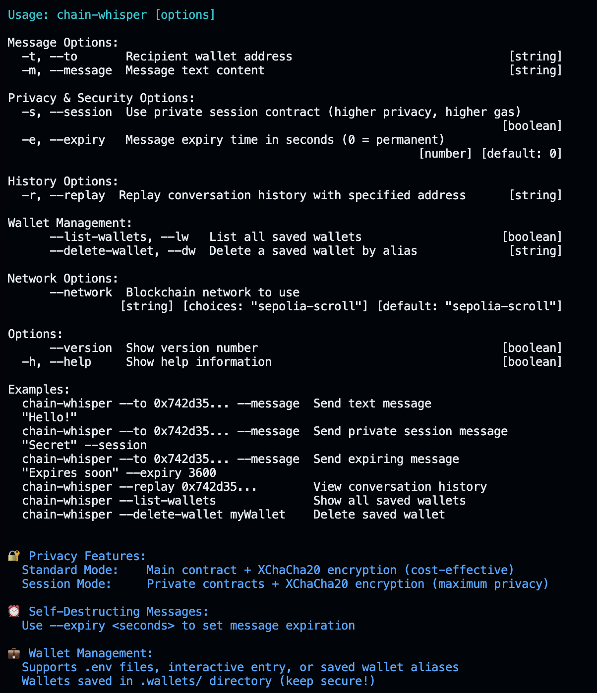
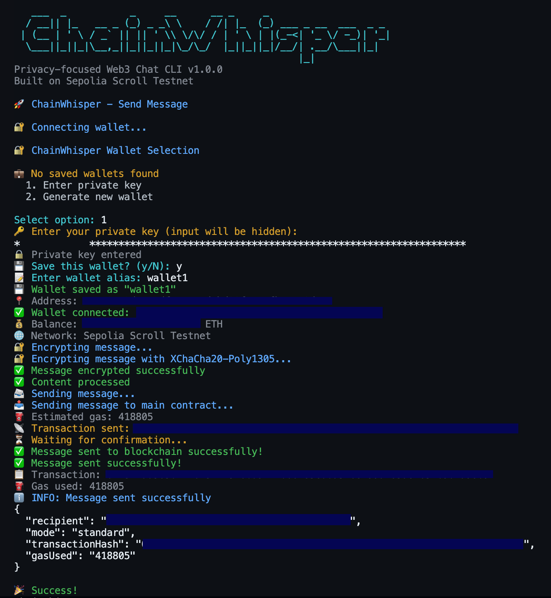
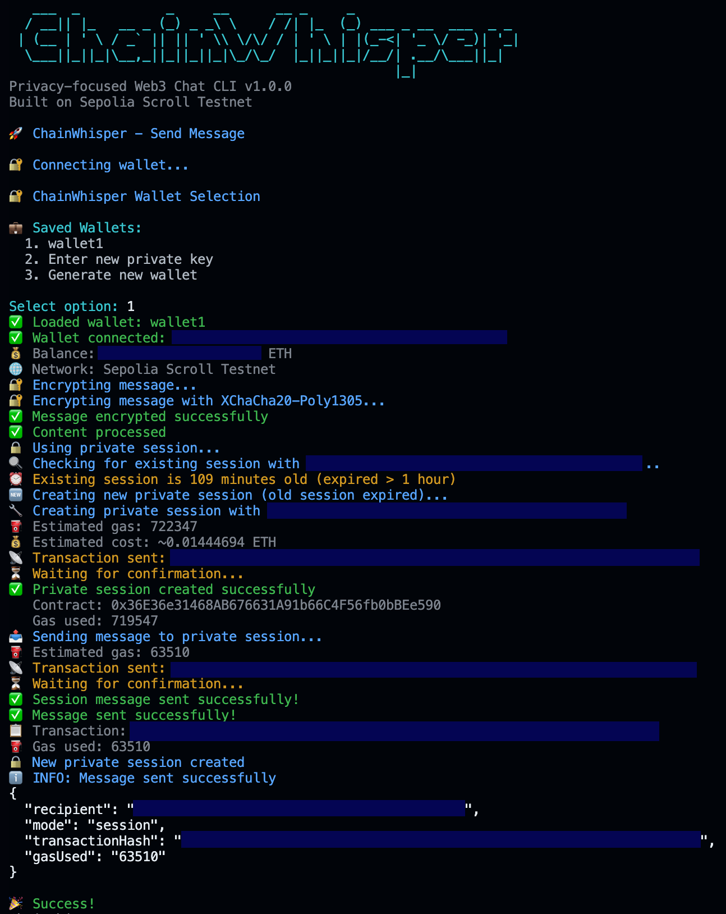
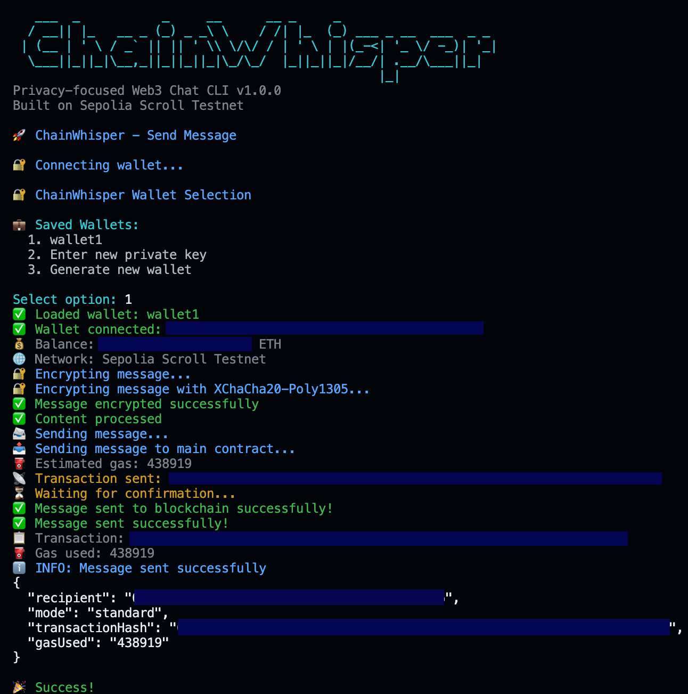
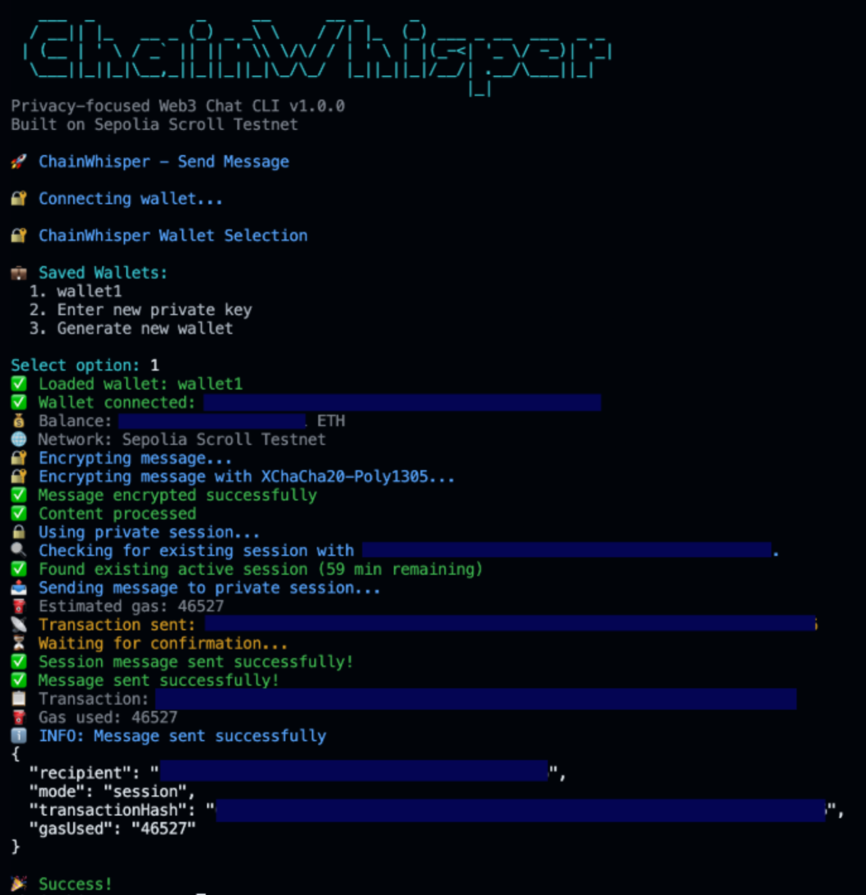
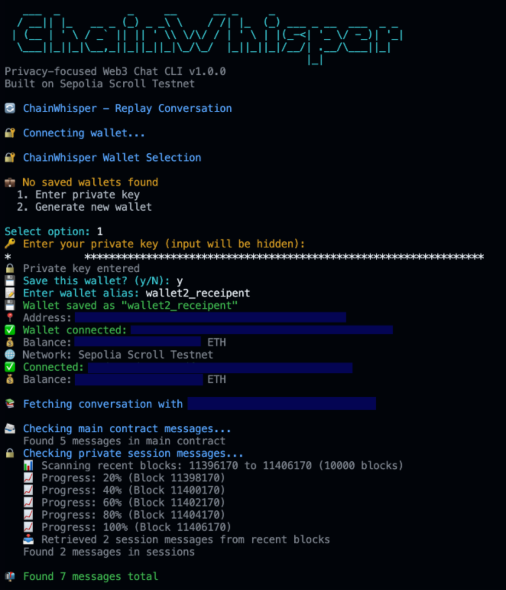
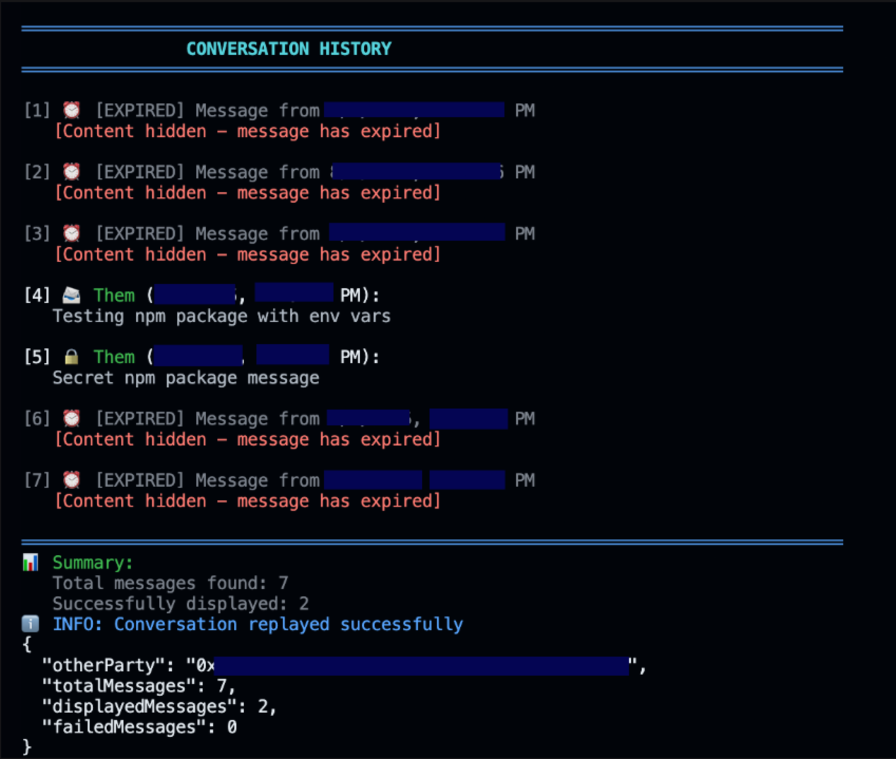
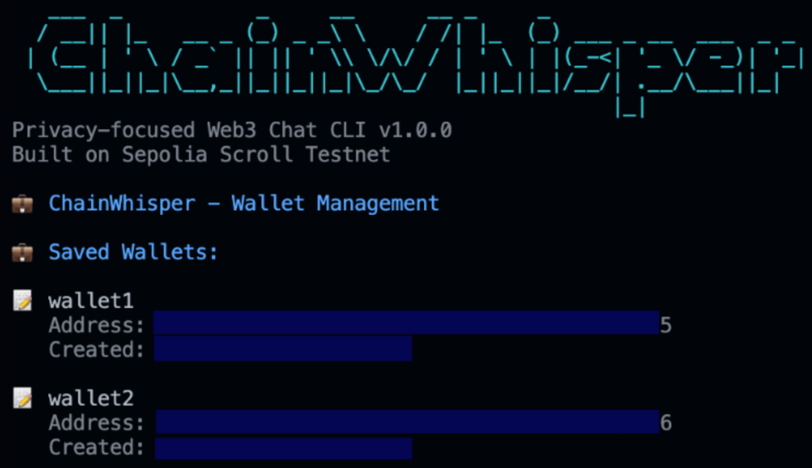

<div align="center">

# ChainWhisper 🔐


[](https://www.npmjs.com/package/chain-whisper)
[](https://opensource.org/licenses/MIT)
[](https://soliditylang.org/)
[](https://nodejs.org/)
[](https://hardhat.org/)
[](https://docs.ethers.org/)


> A CLI-based Web3 messaging system on Scroll Sepolia using XChaCha20-Poly1305 encryption with self-destructing messages.


Features - Installation - Usage - Architecture - Contributing

</div>


## 📋 Overview

ChainWhisper is a cutting-edge Web3 messaging CLI built on the Scroll Sepolia testnet, delivering uncompromised privacy through XChaCha20-Poly1305 encryption, ephemeral session contracts, and self-destructing messages. With its dual-layer privacy architecture, ChainWhisper sets a new standard for secure, decentralized communication.


## ✨ Features

- 🛡️ End-to-End Encryption with XChaCha20-Poly1305 - Ensures robust, modern, and efficient encryption for secure message transmission.

- 🪂 Disposable Session Contracts - Messages are exchanged via ephemeral smart contracts that vanish after use.

- 💣 Self-Destructing Messages - Messages expire after a defined block interval, ensuring time-bound confidentiality.

- 🧱 Built on Scroll Sepolia - Operates on Ethereum's Scroll testnet, providing rollup-level scalability and EVM compatibility.

- 🧑‍💻 CLI-First Experience - Minimalist, terminal-native interface built for privacy-focused developers and power users.


## 🛠 Tech Stack


| **Category**         | **Technology**                  | **Purpose**                                |
|----------------------|----------------------------------|---------------------------------------------|
| Runtime              | Node.js 18+                      | JavaScript runtime environment              |
| Blockchain           | Solidity ^0.8.19                 | Smart contract development                  |
| Development          | Hardhat                          | Ethereum development framework              |
| Blockchain Library   | Ethers.js v6                     | Blockchain interaction                      |
| Encryption           | @stablelib/xchacha20poly1305     | Military-grade encryption                   |
| Key Derivation       | @stablelib/x25519                | ECDH key exchange                           |
| CLI Interface        | yargs                            | Command-line interface                      |
| Styling              | chalk                            | Terminal output formatting                  |
| Network              | Sepolia Scroll Testnet           | Layer 2 testing environment                 |


## 📁 Project Structure

```
ChainWhisper
│ 
├── contracts
│   ├── ChatContract.sol
│   └── ChatFactory.sol
├── hardhat.config.js
├── LICENSE
├── package-lock.json
├── package.json
├── README.md
├── scripts
│   └── deploy.js
└── src
    ├── commands
    │   ├── replay.js
    │   ├── saved.js
    │   └── send.js
    ├── config
    │   └── networks.js
    ├── index.js
    ├── services
    │   ├── blockchain.js
    │   ├── encryption.js
    │   ├── privacyManager.js
    │   ├── sessionManager.js
    │   └── wallet.js
    └── utils
        └── logger.js
```
#

## 🚰 Get Testnet ETH (Scroll Sepolia)

You can get Scroll Sepolia ETH from the following faucets:

- [Scroll Sepolia Faucet](https://sepoliafaucet.scroll.io)
- [Alchemy Sepolia Faucet](https://www.alchemy.com/faucets/ethereum-sepolia)
- [QuickNode Sepolia Faucet](https://faucet.quicknode.com/ethereum/sepolia)


## 💻 Installation (via NPM)

### Prerequisites
- Node.js 18 or higher
- npm or yarn
- Terminal/Command Line access

### Setup

```
# Install ChainWhisper globally (recommended)
npm install -g chain-whisper

# Or install locally in your project
npm install chain-whisper

# Create configuration file
cp node_modules/chain-whisper/.env.example .env

# Edit .env with your configuration

nano .env
```

### Environment Configuration
```
# Contract addresses (pre-configured for Sepolia Scroll)
MAIN_CONTRACT_ADDRESS=0x47E0cc6b3Be7459e06f7a175771BfCD227E38A99
FACTORY_CONTRACT_ADDRESS=0x627C28aD9885951e3B1ffB2701B25f17d39bc33e

# Network configuration
DEFAULT_NETWORK=sepolia-scroll

# RPC Endpoint Options (Choose one - Remove # from your preferred option)
# Option 1: Alchemy (requires API key)
SCROLL_SEPOLIA_RPC=https://scroll-sepolia.g.alchemy.com/v2/YOUR_ALCHEMY_API_KEY

# Option 2: PublicNode (free, no API key required)
# SCROLL_SEPOLIA_RPC=https://scroll-sepolia-rpc.publicnode.com/

# Option 3: Chainstack
# SCROLL_SEPOLIA_RPC=https://scroll-sepolia.chainstacklabs.com

# Option 4: Blast API
# SCROLL_SEPOLIA_RPC=https://scroll-sepolia.public.blastapi.io

# Option 5: dRPC
# SCROLL_SEPOLIA_RPC=https://scroll-sepolia.drpc.org

# Optional: Hardcode private key (not recommended)
# PRIVATE_KEY=your_private_key_here
```

- Alternative: Environment Variables (No .env file needed)
```
# Export configuration to environment (recommended for testing)
export SCROLL_SEPOLIA_RPC="https://scroll-sepolia.g.alchemy.com/v2/YOUR_API_KEY"
export MAIN_CONTRACT_ADDRESS="0x47E0cc6b3Be7459e06f7a175771BfCD227E38A99"
export FACTORY_CONTRACT_ADDRESS="0x627C28aD9885951e3B1ffB2701B25f17d39bc33e"
export DEFAULT_NETWORK="sepolia-scroll"
```

- Help Command

```
chain-whisper --help
```
<div align="center">
    
</div>

- Send a standard message

```
chain-whisper --to "0x742d35..." --message "Hello, Web3!"
```
<div align="center">
    
</div>

- Send a private session message
```
chain-whisper --to "0x742d35..." --message "Secret npm package message" --session
```

<div align="center">
    
</div>

- Send an expiring message (2 minutes)
```
chain-whisper --to "0x742d35..." --message "This npm message expires in 2 minutes" --expiry 120
```

<div align="center">
    
</div>


- Send a private session message with expiry (5 minutes)

```
chain-whisper --to "0x742d35..." --message "Private expiring npm message" --session --expiry 300
```

<div align="center">
  
</div>


- **Interactive Wallet Management** - ChainWhisper automatically launches an interactive wallet selection when no saved wallets are found:

```
🔐 ChainWhisper Wallet Selection

💼 No saved wallets found
  1. Enter private key
  2. Generate new wallet

Select option: 1
🔑 Enter your private key (input will be hidden):
💾 Save this wallet? (y/N): y
📝 Enter wallet alias: wallet1
💾 Wallet saved as "wallet1"
```

- View Messages

```
# View conversation history
chain-whisper --replay "0x742d35..."
```

<div align="center">
  
  
</div>


- Manage Wallets
```
# List saved wallets
chain-whisper --list-wallets

# Delete a saved wallet
chain-whisper --delete-wallet myWallet
```

<div align="center">
  
</div>


- **Example Session Flow** - Sender (Wallet1) → Recipient (Wallet2):

```
# 1. Send messages from sender
export SCROLL_SEPOLIA_RPC="https://scroll-sepolia.g.alchemy.com/v2/YOUR_KEY"
chain-whisper --to "0xRecipient..." --message "Testing npm package with env vars"

chain-whisper --to "0xRecipient..." --message "Secret npm package message" --session

chain-whisper --to "0xRecipient..." --message "This expires in 2 minutes" --expiry 120

# 2. View from recipient perspective
chain-whisper --replay "0xSender..."
Expected Output:
```


- **Network Configuration** - The package is pre-configured for Sepolia Scroll Testnet 


## 🚀 Installation (Local)

### Prerequisites 

- Node.js 18 or higher
- npm or yarn
- Git

### Setup

```
# Clone the repository
git clone https://github.com/techyarnav/ChainWhisper.git
cd ChainWhisper

# Install dependencies
npm install

# Create environment file
cp .env.example .env

# Edit .env with your configuration
nano .env

# Contract addresses (updated automatically on deployment)

MAIN_CONTRACT_ADDRESS=0x47E0cc6b3Be7459e06f7a175771BfCD227E38A99
FACTORY_CONTRACT_ADDRESS=0x627C28aD9885951e3B1ffB2701B25f17d39bc33e

# Network configuration
DEFAULT_NETWORK=sepolia-scroll
SCROLL_SEPOLIA_RPC=https://sepolia-rpc.scroll.io/

# Optional: Hardcode private key (not recommended)

PRIVATE_KEY=your_private_key_here

```

### 🧪 Development

- Compile Contracts
```
# Compile smart contracts
npx hardhat compile

# Run tests (if available)
npx hardhat test

# Deploy to Sepolia Scroll
npx hardhat run scripts/deploy.js --network sepolia-scroll
```

### Network Configuration

- The project is configured for Sepolia Scroll Testnet:

- Chain ID: 534351

- RPC URL: https://sepolia-rpc.scroll.io/

- Explorer: https://sepolia.scrollscan.com/

- Gas Optimization
- Standard Messages: ~400,000 gas

- Session Creation: ~814,000 gas

- Session Messages: ~46,000 gas


### 📖 Usage

### Basic Commands


- Send a standard message
```
npm run start -- --to "0x742d35..." --message "Hello, Web3!"
```
- Send a private session message
```
npm run start -- --to "0x742d35..." --message "Private Session message" --session
```
- Send an expiring message (5 minutes)
```
npm run start -- --to "0x742d35..." --message "This will self-destruct in 5 minutes" --expiry 300
```
- Send a session message that expires in 2 minutes
```
npm run start -- --to "0x742d35..." --message "Message expires in 2 mins and session will self destruct in one hour" --session --expiry 120
```

- View conversation history

```
npm run start -- --replay "0x742d35..."
```
- List saved wallets
```
npm run start -- --list-wallets
```
- Delete a saved wallet
```
npm run start -- --delete-wallet myWallet
```

- Display help
```
npm run start -- --help
```

### **Interactive Wallet Management**

> **When you run any command without a `PRIVATE_KEY` in `.env`, ChainWhisper launches an interactive wallet selection:**

```
🔐 ChainWhisper Wallet Selection

💼 Saved Wallets:
  1. alice     (0x4B3462...)
  2. bob       (0xd6ED9d...)
  3. Enter new private key
  4. Generate new wallet

Select option: 
```


- Example Session Flow

```
# Alice sends to Bob
npm run start -- --to "0xBobAddress..." --message "Hey Bob!" --session

# Bob reads messages
npm run start -- --replay "0xAliceAddress..."

# Output shows:
# [1] 🔒 Them (8/7/2025, 5:45:00 PM):
#    Hey Bob!
#    ⏰ Session expires: 8/7/2025, 6:45:00 PM (45 min remaining)
```

## 🏗 Architecture

**System Overview**
```
┌─────────────────┐    ┌─────────────────┐    ┌─────────────────┐
│   CLI Client    │    │  Smart Contracts│    │  Scroll Network │
│                 │    │                 │    │                 │
│ • Wallet Mgmt   │◄──►│ • ChatContract  │◄──►│ • Sepolia L2    │
│ • Encryption    │    │ • ChatFactory   │    │ • Gas Optimized │
│ • Session Mgmt  │    │ • ChatSession   │    │ • Fast Finality │
└─────────────────┘    └─────────────────┘    └─────────────────┘
```

## Core Components

**1. Smart Contracts**
- ChatContract: Main messaging contract for standard messages

- ChatFactory: Creates and manages disposable session contracts

- ChatSession: Individual private session with 1-hour auto-expiry

**2. Encryption Layer**
- XChaCha20-Poly1305: Authenticated encryption for message content

- ECDH Key Exchange: Secure shared secret generation

**3. Session Management**
- 1-Hour Auto-Expiry: Sessions automatically become inactive

- Smart Reuse: Existing sessions used if under 1 hour old

- Automatic Cleanup: New sessions created when old ones expire

**4. Privacy Layers**
```
Message Privacy Stack:
├── 🔐 XChaCha20-Poly1305 Encryption
├── 🕐 Session Contract Isolation (1-hour disposal)
├── ⏰ Message-Level Expiry (custom timeframes)
└── 🌐 Scroll Layer 2 (enhanced privacy)
```

#
## 🤝 Contributing - We welcome contributions! Please see our Contributing Guide for details.

- Fork the repository

- Create your feature branch (git checkout -b feature/amazing-feature)

- Commit your changes (git commit -m 'Add features')

- Push to the branch (git push origin feature/amazing-feature)

- Open a Pull Request

#

### 📄 License

### This project is licensed under the MIT License - see the LICENSE file for details.
#


<div align="center">

⭐️ **Star this repository if you find it useful!**

**Built with ❤️ for Web3 Privacy**

*Powered by XChaCha20-Poly1305 encryption, Solidity smart contracts, and Node.js*

[](https://nodejs.org/)
[](https://ethereum.org/)
[](https://scroll.io/)
</div>

#